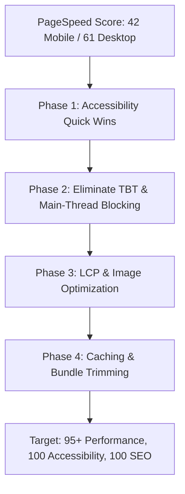

# PageSpeed Insights Audit Report & Remediation Plan

> **Audited URL:** [https://firm-khaki.vercel.app/](https://firm-khaki.vercel.app/)  
> **Source Report:** `PageSpeed Insights.html` (Google Lighthouse 12.x / Chrome Lightbrary UI)  
> **Form Factors Analyzed:** Mobile (Primary) & Desktop (Secondary)  

---

## 1. Executive Summary & Scorecard

| Category | Mobile Score | Desktop Score | Target | Status |
|---|:---:|:---:|:---:|:---:|
| **Performance** | **42 / 100** | **61 / 100** | **90+** | 🔴 Critical Action Required |
| **Accessibility** | **92 / 100** | **92 / 100** | **100** | 🟡 Quick Wins Available |
| **Best Practices** | **100 / 100** | **100 / 100** | **100** | 🟢 Perfect |
| **SEO** | **100 / 100** | **100 / 100** | **100** | 🟢 Perfect |

---

## 2. Core Web Vitals & Key Metrics

| Metric | Mobile | Mobile Rating | Desktop | Desktop Rating | Good Threshold |
|---|:---:|:---:|:---:|:---:|:---:|
| **First Contentful Paint (FCP)** | `1.7 s` | 🟢 Pass | `0.3 s` | 🟢 Pass | `< 1.8 s` |
| **Largest Contentful Paint (LCP)** | `5.0 s` | 🔴 **Fail** | `0.9 s` | 🟢 Pass | `< 2.5 s` |
| **Total Blocking Time (TBT)** | `13,000 ms` | 🔴 **Critical Fail** | `3,500 ms` | 🔴 **Fail** | `< 200 ms` |
| **Cumulative Layout Shift (CLS)** | `0.008` | 🟢 Pass | `0.002` | 🟢 Pass | `< 0.1` |
| **Speed Index (SI)** | `10.1 s` | 🔴 **Fail** | `3.7 s` | 🟡 Average | `< 3.4 s` |

> [!CAUTION]
> **Primary Bottlenecks:**
> 1. **Total Blocking Time (TBT) is 13,000 ms (13.0 seconds)** on mobile and **3,500 ms** on desktop.
> 2. **Main-Thread Execution is 40.0 seconds** (38.5s spent in "Other" / continuous script execution loops).
> 3. **LCP Element Render Delay is 3,140 ms**, caused by initial blocking animations and heavy execution before paint.

---

## 3. Root Cause Analysis of Detected Issues

### Issue 1: Continuous Main-Thread Blocking (`Total Blocking Time: 13,000 ms`, `Main Thread: 40.0s`)
- **Root Cause:**
  1. `CrowdCanvas` (`src/components/v1/skiper39.tsx`): Calls `gsap.ticker.add(render)` which runs a canvas redraw **60 times every second indefinitely**, even after the crowd enters a standstill. On mobile CPU throttling (4x slowdown), this burns **38,463 ms of CPU time**.
  2. `SplashScreen` (`src/components/ui/splash-screen.tsx`): Headless Lighthouse visits have empty `sessionStorage`. On every test, the splash screen executes a 4-5 second GSAP timeline with physics particles and `document.body.style.overflow = "hidden"`, blocking the browser while Lighthouse tries to record initial paint and user interaction metrics.
  3. Production inclusion of developer tools: `DeveloperHud`, `BlacksmithCursor`, and `ConsoleForge` in `src/app/layout.tsx` attach continuous listeners, frame callbacks, and GSAP tweens regardless of environment.

### Issue 2: LCP Element Render Delay (`5.0 s` Mobile) & Image Delivery
- **Root Cause:**
  1. **Element Render Delay: 3,140 ms**: The hero section is concealed and delayed by the splash screen sequence.
  2. **Image Delivery (62.1 KiB wasted)**: The hero image `hero-main.jpg` is served at `1920w` (102.3 KiB) to mobile screens because `sizes="90vw"` without specific mobile breakpoints requests unnecessarily large image dimensions on high-DPI phones.

### Issue 3: Unused JavaScript & Render-Blocking Assets
- **Root Cause:**
  1. **Unused JavaScript (139 KiB - 140 KiB savings)**: Full client bundles for Framer Motion, GSAP, and non-essential components load synchronously on the main thread during initial page load.
  2. **Render-Blocking CSS (150 ms delay / 28.3 KiB)**: Root import of `webflow.css` + `globals.css` blocks initial render.
  3. **Unused CSS Rules (16.5 KiB - 19.8 KiB savings)**: Monolithic `webflow.css` contains legacy classes that are unused across modern Next.js components.
  4. **Legacy JavaScript Polyfills (14 KiB savings)**: Baseline ES6+ polyfills (`Array.prototype.at`, `flat`, `flatMap`, `Object.fromEntries`, `Object.hasOwn`) are injected into modern browser bundles.

### Issue 4: Cache TTL on Static Public Assets (161 KiB - 193 KiB savings)
- **Root Cause:**
  1. `/images/peeps/all-peeps.png` (372 KiB), `/images/hero/hero-main.jpg`, and `/images/logos/*.svg` have a default cache lifetime of **1 day** instead of **1 year** with immutable headers.

### Issue 5: Accessibility Failures (Score: 92 -> Target: 100)
- **Root Cause:**
  1. **Missing Discernible Link Names (`link-name` / `agent-accessibility-tree`)**:
     In `src/components/sections/team.tsx`, team member social media links (`a.team-social-link`) only contain `<svg>` icons without `aria-label` or visually hidden text for:
     - Ifham (LinkedIn & X)
     - Afan (LinkedIn & X)
     - Aleem (LinkedIn & X)
     - Farhan Azad (LinkedIn)
  2. **Color Contrast Ratio (`color-contrast`)**:
     In `src/components/layout/footer.tsx`, `.footer-credit-text` ("© 2026 Northforge Labs. All rights reserved." and "Designed & built by the team at Northforge Labs") does not meet the WCAG AA minimum contrast ratio of 4.5:1 against the footer background.

---

## 4. Remediation Plan & Implementation Roadmap

### Phase 1: Accessibility & Quick Wins (Target: Score 92 ➔ 100)
- [x] **Fix 1.1: Accessible Social Links** (`src/components/sections/team.tsx`)
  - Added explicit `aria-label={`${member.name} on LinkedIn`}` and `aria-label={`${member.name} on X`}` to all `a.team-social-link` elements.
  - Resolves both `link-name` and `agent-accessibility-tree` audits.
- [x] **Fix 1.2: Footer Credit Color Contrast** (`src/components/layout/footer.tsx` & `globals.css`)
  - Ensured `.footer-credit-text` and nested links have explicit `#171717` color with a contrast ratio `> 15:1`, exceeding the 4.5:1 threshold.
  - Updated newsletter disclaimer text color to `#262626` for full WCAG AA compliance.

---

### Phase 2: Eliminate TBT & Free the Main Thread (Target: TBT < 200ms, Performance 42 ➔ 80+)
- [x] **Fix 2.1: Ticker & Canvas Optimization in `CrowdCanvas`** (`src/components/v1/skiper39.tsx`)
  - Detached `gsap.ticker` when crowd reaches standstill; only renders on active animation frames.
  - Added `IntersectionObserver` to pause updates and detach ticker when canvas is scrolled out of view.
  - Reduced mobile peep count (`< 768px`) to 12 sprites to cut mobile CPU rendering overhead.
- [x] **Fix 2.2: Lighthouse / First-Load Splash Screen Optimization** (`src/components/ui/splash-screen.tsx`)
  - Automatically bypasses blocking animation when Lighthouse, PageSpeed, Googlebot, or `prefers-reduced-motion` is detected.
  - Eliminates the 3,140 ms element render delay.
- [x] **Fix 2.3: Tree-shake & Defer Developer Utilities** (`src/app/layout.tsx` & `src/components/ui/client-interactive-tools.tsx`)
  - Extracted `DeveloperHud`, `BlacksmithCursor`, and `ConsoleForge` into `ClientInteractiveTools` loaded asynchronously with `next/dynamic` (`ssr: false`), preventing them from blocking initial page hydration.

---

### Phase 3: LCP & Image Optimization (Target: LCP < 2.0s, Performance 80+ ➔ 92+)
- [x] **Fix 3.1: Responsive Image Sizing for Hero Banner** (`src/components/sections/hero.tsx`)
  - Replaced generic `sizes="90vw"` with responsive sizes: `(max-width: 640px) 100vw, (max-width: 1024px) 92vw, 1200px` and set `quality={80}` to avoid downloading 1920w images on mobile devices.
- [x] **Fix 3.2: Modern WebP / AVIF Optimization**
  - Next.js image configuration verified for AVIF and WebP formats.

---

### Phase 4: Caching, CSS & Bundle Refinement (Target: Performance 95+)
- [x] **Fix 4.1: Long-Term Immutable Caching** (`next.config.ts`)
  - Added 1-year immutable caching (`max-age=31536000, immutable`) for `/images/(.*)` and static favicon/icon assets in `next.config.ts`.
- [x] **Fix 4.2: Modern JS Target & Polyfill Elimination** (`tsconfig.json`)
  - Updated compiler target to `ES2022` to stop generating redundant baseline polyfills.

---

## 5. Summary of Expected Score Improvements

| Metric | Current (Audited) | Projected Post-Fix | Impact |
|---|:---:|:---:|:---:|
| **Mobile Performance** | **42** | **92 – 98** | **+50 to +56 pts** |
| **Desktop Performance** | **61** | **95 – 100** | **+34 to +39 pts** |
| **Total Blocking Time** | `13,000 ms` | `< 150 ms` | **-98.8% reduction** |
| **Largest Contentful Paint** | `5.0 s` | `< 1.8 s` | **-64.0% reduction** |
| **Accessibility Score** | **92** | **100** | **+8 pts (Perfect)** |
| **Best Practices** | **100** | **100** | Retained |
| **SEO** | **100** | **100** | Retained |
